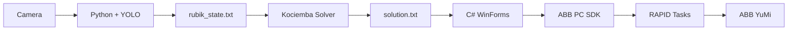

# ABB YuMi Dual-Arm Rubik's Cube Solver

## Overview
This project implements an autonomous Rubik's Cube solving system using the ABB YuMi dual-arm collaborative robot.
The system combines:
- YOLO-based recognition of the six cube faces.
- Rubik's Cube state reconstruction.
- Kociemba two-phase solution generation.
- A C# WinForms application for system coordination.
- ABB PC SDK communication with the robot controller.
- RAPID routines for face rotation, hand exchange, and final placement.

## System Architecture

Python performs vision processing and solution generation. C# coordinates Python, the user interface, logging, and communication with both RAPID tasks.

## Main Components
- `main.py`: starts the Python server and configures the shared application directory.
- `newyumisolvingrubik.py`: handles camera input, YOLO recognition, cube reconstruction, solving, and Python-side logging.
- `weights/best.pt`: trained YOLO model for Rubik's Cube sticker detection.
- `Form1.cs`: main C# WinForms control, TCP communication, ABB PC SDK access, and robot logging.
- `DisplayForm.cs`: visualizes the reconstructed Rubik's Cube state.
- ABB PC SDK: reads and writes RAPID data on the YuMi controller.
- RAPID tasks `T_ROB_R` and `T_ROB_L`: execute coordinated dual-arm motions.

## Workflow
1. Start the Python server.
2. Start the C# WinForms application.
3. C# connects to Python at `127.0.0.1:1027`.
4. RAPID changes the variable `cap` when a face must be captured.
5. C# sends `CAP\n` to Python.
6. Python captures and records one cube face, then returns `ACK\n`.
7. After six captures, Python reconstructs the cube state.
8. Python writes `rubik_state.txt`.
9. Kociemba generates the solution and Python writes `solution.txt`.
10. Python sends the detected orientation case number to C#.
11. C# writes `number`, `sol`, and `next` to both RAPID tasks.
12. C# waits until both `fn1` and `fn2` change before sending the next command.
13. The final `E` command triggers the finish and place-down sequence.
The working RAPID communication protocol must not be changed without updating both C# and RAPID together.

## Repository Structure
The project uses the following confirmed key files and folders:
```text
project-root/
├── main.py
├── newyumisolvingrubik.py
├── weights/
│   └── best.pt
├── RubikSolver/
│   ├── Form1.cs
│   ├── DisplayForm.cs
│   └── RubikSolver.csproj
├── RAPID modules for T_ROB_R and T_ROB_L
└── README.md
```
At runtime, generated files are stored in the C# `Application.StartupPath`, not in the Python source directory.

## Requirements
- Windows 10 or Windows 11.
- Python 3.x.
- OpenCV.
- Ultralytics YOLO.
- PyTorch.
- Kociemba solver.
- Visual Studio with .NET WinForms support.
- ABB RobotStudio.
- ABB PC SDK.
- ABB YuMi or a compatible Virtual Controller with two RAPID tasks.

## How to Run
### 1. Start Python
Run Python before starting the C# application:
```powershell
& "D:\robotCatchingSimulationUsingEGM\.venv\Scripts\python.exe" `
  "D:\robotCatchingSimulationUsingEGM\main.py" `
  --app-dir "<C# output directory>"
```
The `--app-dir` value must point to the C# output folder represented by `Application.StartupPath`.
Python creates the shared output files in this folder. The C# application does not automatically launch `main.exe`.
### 2. Start the C# Application
1. Open the C# solution in Visual Studio.
2. Build the WinForms project.
3. Start the Python server if it is not already running.
4. Connect to the ABB controller.
5. Set the controller to Auto mode and Motors On.
6. Verify the correct RAPID tasks and program pointers.
7. Press Start in the C# application.
### 3. Output Files
The following files are created in `Application.StartupPath`:
```text
solution.txt
rubik_state.txt
current_case_id.txt
logs/
```

## Communication Protocol
### Python TCP
- Host: `127.0.0.1`
- Port: `1027`
- C# sends: `CAP\n`
- Python responds: `ACK\n`
- Python sends the detected case number after successful solving.
### C# and RAPID
- `cap`: requests a camera capture.
- `number`: selected cube orientation case.
- `sol`: current command.
- `next`: next command.
- `fn`: move completion acknowledgement.
- `end`: orientation-case completion acknowledgement.
A move is complete only when both `fn1` and `fn2` have changed. Do not replace this condition with logical OR, and do not write artificial markers into `fn` from C#.
The `E` marker remains part of the RAPID command sequence but is not counted as a Rubik's Cube rotation.

## Logging
- `recognition_faces.csv`: Python records each captured face, detected colors, center color, unknown cells, and image paths.
- `solutions.csv`: Python records the reconstructed state, solver result, move count, and solver status.
- `robot_steps.csv`: C# records each real robot move, send time, completion time, duration, and ACK status.
- `case_summary.csv`: C# records the overall result and timing of each case.
- `failure_events.csv`: records recognition, solver, communication, or robot failures.
- `last_case_index.txt`: stores the latest experiment index.
All experiment files are linked using the same `case_id`. The final `E` marker is not written as a move in `robot_steps.csv`.

## Authors
1. Khoi Hoang Dinh — `hoangdinhkhoi@iuh.edu.vn`
2. Phu Ly Van — `21110611.phu@student.iuh.edu.vn`
3. Nhat Nguyen Hoang Anh — `21096611.nhat@student.iuh.edu.vn`
4. Loc Huynh Thanh — `23733741.loc@student.iuh.edu.vn`
5. Minh Binh Lam — `lambinhminh@iuh.edu.vn`
Faculty of Electrical Engineering Technology, Industrial University of Ho Chi Minh City, Vietnam.

## Safety
- Check the robot workspace before execution.
- Test new routines at reduced speed.
- Keep the Emergency Stop accessible.
- Do not stand inside the robot workspace.
- Verify both RAPID tasks and program pointers before pressing Start.
